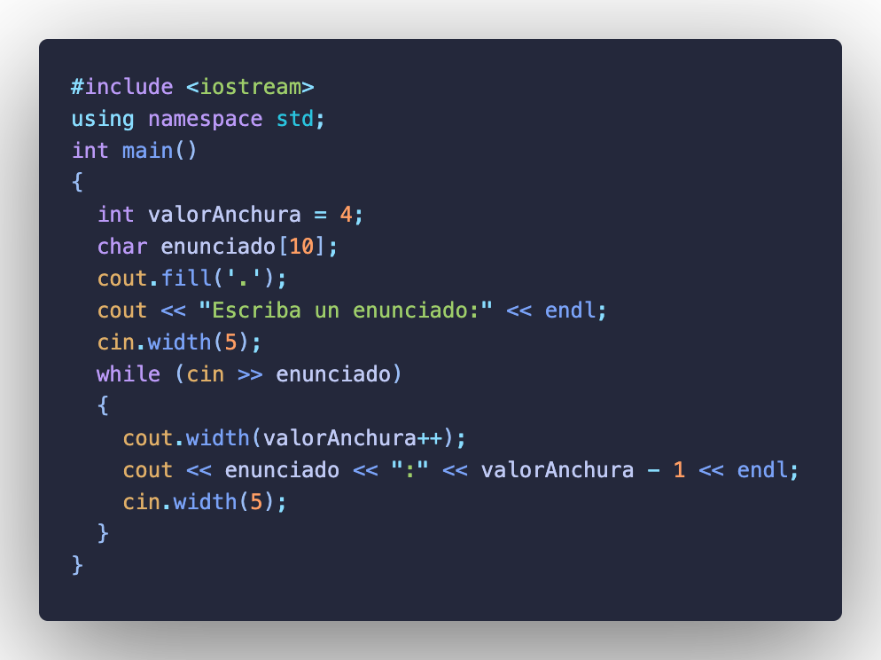

# Punto de Control #09

## :copyright: Autor

- :camera: 
- :boy: **Felipe Lin Zhao**
- :e-mail: felipelinchiu321@gmail.com
- :link: [github.com/Perz1vaI](https://github.com/Perz1vaI)
- :calendar: 2020-09-13 18:00 CST

---

## :dart: Objetivos

Completar la tarea que fui asignado a hacer.

---

## :black_circle: eof_get_y_put.cpp

---

## :black_circle: cin_y_cin-get.cpp

---
## :black_circle: cin-getline.cpp

---
## :black_circle: read_y_write.cpp

---
## :black_circle: dec_oct_hex_y_setbase.cpp

---
## :black_circle: dec_oct_hex_y_setbase2.cpp

---
## :black_circle: cout-width.cpp

---
## :black_circle: cout-setw.cpp

---
## :black_circle: cout-setw2.cpp

---
## :black_circle: scientific_y_fixed.cpp

---
## :black_circle: acceso_aleratorio.cpp

---

## :computer: Código

- :blue_book: [Punto de Control #09](https://github.com/Perz1vaI/C-_PDC_-09.git)

---
#### Herramientas:
- :package: [Visual Studio Code](https://code.visualstudio.com/)
- :camera: [Polacode-2020 v0.5.2](https://github.com/jeff-hykin/polacode)
- :notebook: [Markdown Cheatsheet](https://github.com/adam-p/markdown-here/wiki/Markdown-Cheatsheet)
- :smile: [Emoji Cheat Sheet](https://www.webfx.com/tools/emoji-cheat-sheet/)